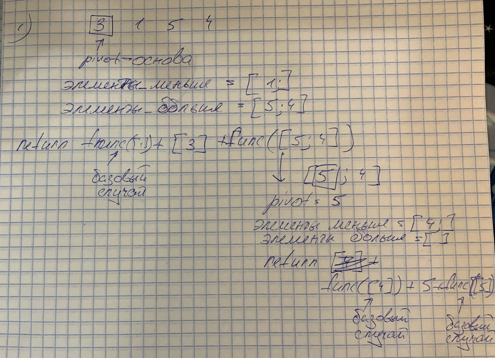
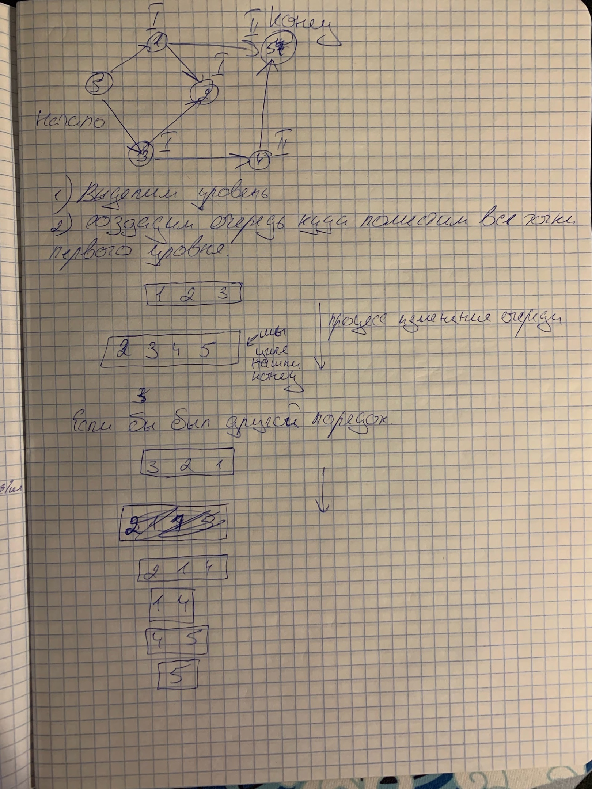
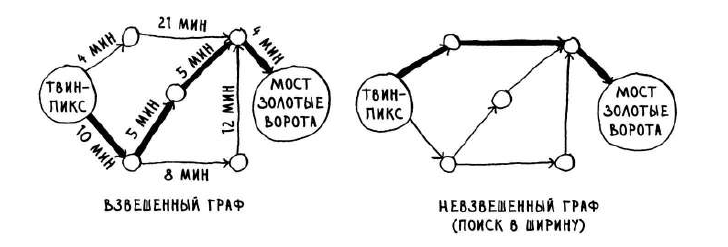

# Конспект по книге Грокаем Алгоритмы

## Бинарный поиск

Для работы бинарного поиска нужна изначально отсортированная последовательность

```python
def get_index_of_value_in_array(value, array):
    '''
    получить позицию value в списке array,
    используя бинарный поиск
    '''
    low = 0
    high = len(array) - 1
    while low < high:
        middle_index = int((low + high) / 2)
        middle_value = array[middle_index]
        if value == middle_value:
            return middle_index
        if value > middle_value:
            low = middle_index + 1
        else:
            high = middle_index - 1
    return middle_index

assert get_index_of_value_in_array(3, [1, 2, 3, 4, 5]) == 2
assert get_index_of_value_in_array(5, [1, 2, 4, 5]) == 3
print('ALL OK')


def index_for_value(nums, target):
    '''
    получить индекс для чиcла value куда вставить значение в список arr, чтобы он продолжал быть
    отсортированным
    '''
    start, end = 0, len(nums) - 1
    result = None
    while start <= end:
        mid_index = (start + end) // 2
        mid_value = nums[mid_index]
        if target == mid_value:
            return mid_index
        if target > mid_value:
            start = mid_index + 1
            result = mid_index + 1
        else:
            end = mid_index - 1
            result = mid_index
    return result

assert index_for_value(1, [2, 3, 10, 18]) == 0
assert index_for_value(5, [2, 3, 10, 18]) == 2
assert index_for_value(5, [2, 3, 5, 10, 18]) == 3
print('ALL OK')
```

## Массивы и связанные списки

**[Посмотреть на мою реализацию связанного списка можно тут](https://github.com/Rwwwrl/linked_list)**

Связанные списки отлично подходят в тех ситуациях, когда они должны
читаться последовательно, но если мы намерены прыгать по списку туда-сюда, стоить держаться подальше от связанных списков.  
С массивам дело обстоит совершенно иначе, работая с массивом, мы заранее знаем адрес каждого элемента

#### Добавление

Списки, лучше подходят для вставки элементов в середину, т.к в этом случае нужно только поменять
указатель прыдущего элемента. В массиве же нужно все элемента после нашего передвинуть вправо.

#### Удаление

Удаление также лучше работает с связанными списками, все что нужно это поменять указатель.
В списке аналогично добавление все последующие элементы нужно двигать влево.

|          | Массив | Связанные списки                     |
| -------- | ------ | ------------------------------------ |
| Чтение   | O(1)   | O(n)                                 |
| Вставка  | O(n)   | O(1) (в начало или конец) / **O(n)** |
| Удаление | O(n)   | O(1) (в начало или конец) / **O(n)** |

**Вывод:** Как мы видим, если мы хотим использовать серединные значения, а не только начало и конец, то связанному списку также нужно O(n), и тогда он ни в чем не проигрывает списку **=>** **Мы используем связанные списки только тогда, когда нам нужно обращаться к элементам по концам.**

---

Если мы у нас есть задача добиться _чтения/добавления/удаления_ за _O(1)_, то нам нужно держать _маркировки_ не только на _начало/конец_, но и на _node_ по середине, в целом можно кастомизировать связанный список как нам удобно.

## Сортировка выбором

Есть массив, проходимся по массиву и ищем минимальный элемент - добавляем его в другой массив, а из прежнего удаляем

```python
def find_smallest(arr):
    '''
    поиск минимального значения в массиве arr
    '''
    smallest_value = arr[0]
    smallest_index = 0
    for i in range(1, len(arr)):
        if arr[i] < smallest_value:
            smallest_value = arr[i]
            smallest_index = i
    return smallest_index

def sort_arr(arr):
    '''
    функция сортировки массива методом вставки
    '''
    sorted_arr = []
    for i in range(len(arr)):
        smallest_index = find_smallest(arr)
        sorted_arr.append(arr[smallest_index])
        arr.pop(smallest_index)
    return sorted_arr

print(sort_arr([1, 3, 6, 8, 7]))  # [1, 3, 6, 7, 8]
```

## Рекурсия

Каждый рекурсивная функция состоит из двух вещей - _базового случая_ и _рекурсивного случая_

```python
def factorial(n):
    if n == 1:
        return 1
    return n * factorial(n - 1)

print(factorial(3))  # 6
```

## Стек

**Стек** - структура данных  
Все для чего она нужна это для добавления нового элемента вначало и удаления элемента с конца

### Стек вызовов

> когда мы вызываем функцию внутри другой функции, вызываемая функция приостанавливается в частино завершенно состоянии. Это означает, что все значения переменных остаются в памяти (что логично).

### Реализации стека

1. **Использовать список**, а именно методы _append_ и _pop_, **но!**
   Список изначально был сделан для произовольного доступа к элементам, это значит что весь список это единный объем памяти, еслиу нас огромный список, то добавление в конец может происходить дольше чем обычно. В этом случае **мы используем то, что нам нужно!**
2. **deque** - очерередь, основанная на двухсвязнном списке.

```python
from collections import deque

deq = deque([1, 3, 4, 7])
deq.append(8)
print(deq)  # [1, 3, 4, 7, 8]
deq.pop()
print(deq)  # [1, 3, 4, 7]
```

## Метод разделяй и влавствуй ( Divide-and-conquer algorithm )

метод не является конкретным решением одной задачи, это один из часто использующихся инструментов при решении алгоритмитмических задач. Решение методы разделяй и властвуй состоит из двух этапов

1. Определить базовый случай
2. Задачи делится или сокращается до тех пор пока, не будет сведена к базову случаю

### **_Пример 1:_** функция подсчета суммы массива

#### Не используя метод разделяй и властвуй

```python
def sum(arr):
    '''
    функция подсчета суммы массива НЕ используя метод разделяй и властвуй
    '''
    count = 0
    for value in arr:
        count += value
    return count

print(sum([1, 2, 3]))  # 6
```

#### Используя метод разделяй и властвуй

```python
def sum(arr):
    '''
    Функция подсчета суммы массива методом разделяй и властвуй
    ( В данном случай базовым случаем является массив из одного элемента )
    '''
    # базовый случай
    if len(arr) == 1:
        return arr[0]
    count = 0
    count += arr[0] + sum(arr[1:])
    return count
```

### **_Пример 2:_** функция подсчета суммы связанного списка

```python
n1 = Node(0)
n2 = Node(1)
n3 = Node(2)
n4 = Node(3)
n1.next = n2
n2.next = n3
n3.next = n4
```

#### Не используя метод разделяй и властвуй

```python
def sum(head):
    '''
    Функция подсчета суммы связанного списка НЕ методом разделяй и властвуй
    '''
    node = head
    count = 0
    while node:
        count += node.data
        node = node.next
    return count

assert sum(n1) == 6
```

#### Используя метод разделяй и властвуй

```python
def sum(head):
    '''
    Функция подсчета суммы связанного списка методом разделяй и властвуй
    ( Базовый случай: У связанного списка value -> None сумма = value)
    '''
    count = 0
    # базовый случай
    if not head.next:
        return head.data
    count = head.data + sum(head.next)
    return count

assert sum(n1) == 6
```

### **_Пример 3:_** функция для нахождения максимального элемента в списке

#### Не используя метод разделяй и властвуй

```python
def get_max_value_in_arr(arr):
    '''
    Функция для нахождения максимального элемента в массиве НЕ методом разделяй и властвуй
    '''
    max_value = arr[0]
    for value in arr:
        if value > max_value:
            max_value = value
    return max_value

assert get_max_value_in_arr([0, 10, -9, 2]) == 10
```

#### Используя метод разделяй и властвуй

```python
def get_max_value_in_arr(arr):
    '''
    Функция для нахождения максимального элемента в массиве методом разделяй и властвуй
    ( Базовый случай: в массиве из одного элемента максимальным значением является этот элемент)
    '''
    # базовые случай
    if len(arr) == 1:
        return arr[0]
    max_value = arr[0]
    value = get_max_value_in_arr(arr[1:])
    if value > max_value:
        max_value = value
    return max_value

assert get_max_value_in_arr([0, 10, -9, 2]) == 10
```

### Алгоритм быстрой сортировки

В его идеи заложен метод разделяй и властвуй  
**_В чем суть?_**
Мы выбираем _опорный элемент_ **_(pivot)_** и помещаем слева от него все элементы, которые **меньше** его, а справа наоборот **больше**, и опять проходимся функцией уже по этим массивам.
скорость работы - **_O(n log(n)) < work < O(n _ 2)\***, она зависит от выбора опорного элемента.

_Рис.1. Алгоритм работы для массива [3, 1, 5, 4]_

```python
def quick_sort(arr):
    '''
    Функция быстрой сортировки
    ( Базовый случай: пустой или из одного элемента массив уже отсортирован, и мы просто возвращает его )
    '''
    # базовый случай
    if len(arr) < 2:
        return arr

    # опорный элемент
    pivot = arr[0]

    smaller_elements = [value for value in arr[1:] if value <= pivot]
    greater_elements = [value for value in arr[1: ] if value > pivot]

    return quick_sort(smaller_elements) + [pivot] + quick_sort(greater_elements)


assert quick_sort([3, 1, 5, 4])  == [1, 3, 4, 5]
assert quick_sort([4, 2, 1, 10, 6, 9, 7, 9, 5])  == [1, 2, 4, 5, 6, 7, 9, 9, 10]
```

## Хеш-таблицы

Есть пустой массив [], есть функция конвертирующая _объект_ (строку, число, экземпляр - неважно) в число. Это число является индексом в массиве куда и заносится наш _объект_. Именно из-за того что мы используем массив, скорость чтения в словаре - **_O(1)_** .  
Хеш-функция связывает название с индексом в массиве, для одной строки неизменно должно быть одного и тоже число, для каждой строки - отличное от других число.

### Коллизии

**_Выбор хеширующей функции очень важен_**. Представим, что у нас есть массив из 33 элементов, каждый элемент отвечает за букву в алвафите, так - "абрикос" попадет на позицию с индексов 0, а "банан" на позицию с индексов 1. Но если у нас еще появится "апельсин", то куда его девать? В таком случай на позиции 0 уже создается связанный список. И проблема тут очевидна. Представим, что у нас магазин торгует только продуктами на букву "а", на позиции 0 у нас находится связанные список, и тогда чтобы найти какой-то элемент мы тратим время O(n), никакого O(1) тут уже нет. **При этом!** все оставшиеся позиции в массиве у нас пусты, это пример **неудачного выборка** хеширующей функции.

| Поиск    | Хеш таблицы (средний случай) | Хеш таблицы (худший случай) | Массив | Связанные список |
| -------- | ---------------------------- | --------------------------- | ------ | ---------------- |
| Поиск    | O(1)                         | O(n)                        | O(1)   | O(n)             |
| Вставка  | O(1)                         | O(n)                        | O(n)   | O(1)             |
| Удаление | O(1)                         | O(n)                        | O(n)   | O(1)             |

## Поиск в ширину (breadth-first search)

Алгоритм для решения задачи поиска кратчайшего пути называется **_поиском в ширину_**.
**Два вопрос на которые может ответить алгоритм поиска в ширину:**

1. Существует ли путь от узла А к узлу Б
2. Как выглядит кратчаший путь от узла А к узлу Б

Представим, что у нас есть друзья и у них в свою очередь тоже, среди всех них нам нужно найти ближайшего продавца манго (ближайший = в каком "поколении" друзей он находится - продавец манго среди вашей друзей ближе, чем среди друзей друга.).
Так как тогда найти **ближайшего** продавца среди всех друзей?
Пусть ваши друзья будут первого уровня, а друзья друзей - второго. Тогда первым делом мы проходися по очереди по всех друзьям и для каждого друга в эту же очередь мы закидываем его друзей. Первым делом мы обходим все друзей первого уровня и только потом, если не был найден продавец - друзей второго уровня. Почему это важно? Если мы пойдем смотреть друзей второго уровня, не посмотрев всех друзей первого уровня, и найдем там продавца, то это может быть не ближайший продавец, если был еще один в числе не просмотренных друзей первого уровня.

_Рис.2. Алгоритм поиска кратчайшего расстояния на графе._
У графа ребра могут быть направлены в обе стороны. Графы, у которых ребра направлены только в одном направление - являются **деревьями**.
**Задача:** Дан граф, надо среди всех друзей найти **ближайшего** продавца манго.

```python
graph = {
    "you": ["alice", "bob"],
    "bob": [],
    "alice": ["masha", "veronika"],
    "masha": [],
    "veronika": ["matvei", "pasha"],
    "matvei": [],
    "pasha": ["mango_seller"],
}

another_graph = {
    "you": ["alice", "bob", "mango_seller"],
    "bob": [],
    "alice": ["masha", "veronika"],
    "masha": [],
    "veronika": ["matvei", "pasha"],
    "matvei": [],
    "pasha": ["mango_seller"],
}

graph_without_seller = {
    "you": ["alice", "bob"],
    "bob": [],
    "alice": ["masha", "veronika"],
    "masha": [],
    "veronika": ["matvei", "pasha"],
    "matvei": [],
    "pasha": [],
}

# тут alice находится одновременно в друзьях у двух людей
graph_with_multiple_friends = {
    "you": ["alice", "bob"],
    "bob": [],
    "alice": ["masha", "veronika"],
    "masha": [],
    "veronika": ["matvei", "pasha"],
    "matvei": ["alice", "mango_seller"],
    "pasha": [],
}
```

```python
from collections import deque


def is_mango_seller(name):
    return name == "mango_seller"


def get_nearby_mango_seller(graph):
    """
    Получить ближайшего продавца манго с помощью алгоритмы в ширину
    """
    deq = deque()
    deq.append(graph["you"])
    # нам не нужно добавлять друзей пользователей в очередь, есть мы это уже делали
    # такое может быть, если друг находится в друзьях у множества людей, тогда мы можем попасть в бесконечный цикл.
    already_checked = set()
    while deq:
        friends = deq.popleft()
        for friend in friends:
            if not friend in already_checked:
                if is_mango_seller(friend):
                    return f"{friend} in {friends} is mango seller"
                deq.append(graph[friend])
                already_checked.add(friend)
    return "There is no mango seller"


# когда продавец находится на второе уровне
assert get_nearby_mango_seller(graph) == "mango_seller in ['mango_seller'] is mango seller"
# когда продавец находится на первом уровне
assert get_nearby_mango_seller(another_graph) == "mango_seller in ['alice', 'bob', 'mango_seller'] is mango seller"
# когда продавца нет
assert get_nearby_mango_seller(graph_without_seller) == "There is no mango seller"
# когда один человек есть у нескольких человек в друзьях
assert (
    get_nearby_mango_seller(graph_with_multiple_friends) == "mango_seller in ['alice', 'mango_seller'] is mango seller"
)
```

### Взвешенный граф

В предыдущей главе мы рассматривали _поиск в ширину_. Этот алгортим находит пусть с _минимальным сегментов_, но что если к каждому сегменту у нас еще будет привязано какое то число, допустим время (вес этого сегмента). В таком случае кратчайшим (наибыстрейшим) расстоянием будет не минимальное количестов ребер, а минимальное времмя затраченное на путь. Быстрее всего поиск такого пути делается при помощи **_алгоритма Дейкстры_**.

_Рис.3. Поиск кратчайшего пути в взвешенном графе vs невзвешенном графе_
Алгоритм Дейкстры работает только с _направленными ациклическими графами_.
Использование алгоритмы Дейкстры невозможно в графе, содержащем ребра с отрицательным весом, вместо этого следует использовать _алгортм Беллмана-Форда_.

_Рис.4. Поиск кратчайшего пути в взвешенном графе_

> В книге алгоритм имеет другой вид только потому что начальное значение графа задается по другому.

```python
from collections import namedtuple, deque
import math

GraphNode = namedtuple('GraphNode', ['index', 'weight'])

graph = {
    1: [GraphNode(2, 2), GraphNode(3, 1), GraphNode(4, 4)],
    2: [GraphNode(4, 7), GraphNode(5, 2.5)],
    3: [GraphNode(5, 10), GraphNode(6, 4)],
    4: [GraphNode(6, 5)],
    5: [GraphNode(6, 4)],
    6: [],
}


class Graph:
    def __init__(self, graph: dict):
        self.graph = graph

    def _get_actualized_graph(self, start_position: int):
        '''
        тут мы убираем те точки графа, до которые не сможем дотянуться от стартовой позиции
        ( чтобы они не участвовали в дальнейших расчетах в алгоритме )
        '''
        duplicates = set()
        deq = deque()
        deq.append(start_position)
        result = []
        while deq:
            for node in self.graph[start_position]:
                if not node.index in duplicates:
                    deq.append(node.index)
                    duplicates.add(node.index)
            start_position = deq.popleft()
            result.append(start_position)

        actualized_graph = {i: self.graph[i] for i in result}
        impossible_nodes_in_graph = {}
        for key in self.graph:
            if key not in actualized_graph:
                impossible_nodes_in_graph[key] = 'До этого узла невозможно дотянуться со стартовой позиции'
        return actualized_graph, impossible_nodes_in_graph

    @staticmethod
    def _get_smallest_node_in_a_row(row: list):
        '''
        получить минимальное значение и его индекс в массиве
        '''
        smallest_node_weight, smallest_node_index = math.inf, -1
        for key in row:
            if row[key] < smallest_node_weight:
                smallest_node_weight = row[key]
                smallest_node_index = key
        return smallest_node_weight, smallest_node_index

    @staticmethod
    def _create_row(actualized_graph: dict, actual_row: dict, previous_row: dict, actual_result: dict) -> dict:
        '''
        сконструировать массив на основе уже найденных максимумов, предыдушей и
        актуальной строки
            [0, inf, inf, inf]
        +
                [2,   1]
            (0 мы уже определили как максимум)
        ------------------------
            [inf, 2, 1,   inf]
        '''
        result = {}
        for i in actualized_graph.keys():
            node_value = actual_row.get(i, None)
            node_value_from_result = actual_result.get(i, None)
            if node_value_from_result is not None:
                node_value = math.inf
            elif not node_value:
                node_value = previous_row[i]
            result[i] = node_value
        return result

    def _get_shortest_paths_to_all_nodes_in_graph(self, actualized_graph: dict, start_position: int):
        '''
        получить минимальные по весу пути до каждой точки при помощи
        алгоритма Дейкстры
        '''

        rows_deque = deque()
        result = {start_position: 0}

        # инициализируем начальную строку
        initial_row = {i: math.inf for i in actualized_graph}
        initial_row[start_position] = 0
        rows_deque.append(initial_row)

        # указатели на индекс и значение текущего узла
        current_index, current_value = start_position, 0

        while len(result) < len(actualized_graph):
            row_values = {}
            previous_row = rows_deque.popleft()

            for node in actualized_graph[current_index]:
                summ = node.weight + current_value
                node_weight_on_previous_row = previous_row[node.index]
                if summ < node_weight_on_previous_row:
                    row_values[node.index] = summ
                else:
                    row_values[node.index] = node_weight_on_previous_row
            row = self._create_row(actualized_graph, row_values, previous_row, result)
            rows_deque.append(row)

            smallest_node_weight, smallest_node_index = self._get_smallest_node_in_a_row(row)
            current_index = smallest_node_index
            current_value = smallest_node_weight
            result[smallest_node_index] = smallest_node_weight

        return result

    def get_shortest_paths_to_nodes(self, start_position: int = 1):
        '''
        метод, где мы сначала актуализирум граф, для которого потом и вычисляем по алгоритму Дейкстры кратчайшие пути
        ( у меня была логика написать алгоритм Дейксты в вакууме, а все преобразования нужные для него и после него
        производить в другом методе )
        '''
        actualized_graph, impossible_nodes_in_graph = self._get_actualized_graph(start_position)
        calcualted_weight_to_nodes = self._get_shortest_paths_to_all_nodes_in_graph(actualized_graph, start_position)
        calcualted_weight_to_nodes.update(impossible_nodes_in_graph)
        return dict(sorted(calcualted_weight_to_nodes.items()))


graph = Graph(graph)

assert graph.get_shortest_paths_to_nodes() == {1: 0, 2: 2, 3: 1, 4: 4, 5: 4.5, 6: 5}
assert graph.get_shortest_paths_to_nodes(start_position=2) == {
    1: 'До этого узла невозможно дотянуться со стартовой позиции',
    2: 0,
    3: 'До этого узла невозможно дотянуться со стартовой позиции',
    4: 7,
    5: 2.5,
    6: 6.5
}
assert graph.get_shortest_paths_to_nodes(start_position=3) == {
    1: 'До этого узла невозможно дотянуться со стартовой позиции',
    2: 'До этого узла невозможно дотянуться со стартовой позиции',
    3: 0,
    4: 'До этого узла невозможно дотянуться со стартовой позиции',
    5: 10,
    6: 4
}

assert graph.get_shortest_paths_to_nodes(start_position=4) == {
    1: 'До этого узла невозможно дотянуться со стартовой позиции',
    2: 'До этого узла невозможно дотянуться со стартовой позиции',
    3: 'До этого узла невозможно дотянуться со стартовой позиции',
    4: 0,
    5: 'До этого узла невозможно дотянуться со стартовой позиции',
    6: 5
}
assert graph.get_shortest_paths_to_nodes(start_position=5) == {
    1: 'До этого узла невозможно дотянуться со стартовой позиции',
    2: 'До этого узла невозможно дотянуться со стартовой позиции',
    3: 'До этого узла невозможно дотянуться со стартовой позиции',
    4: 'До этого узла невозможно дотянуться со стартовой позиции',
    5: 0,
    6: 4
}
assert graph.get_shortest_paths_to_nodes(start_position=6) == {
    1: 'До этого узла невозможно дотянуться со стартовой позиции',
    2: 'До этого узла невозможно дотянуться со стартовой позиции',
    3: 'До этого узла невозможно дотянуться со стартовой позиции',
    4: 'До этого узла невозможно дотянуться со стартовой позиции',
    5: 'До этого узла невозможно дотянуться со стартовой позиции',
    6: 0
}

```
